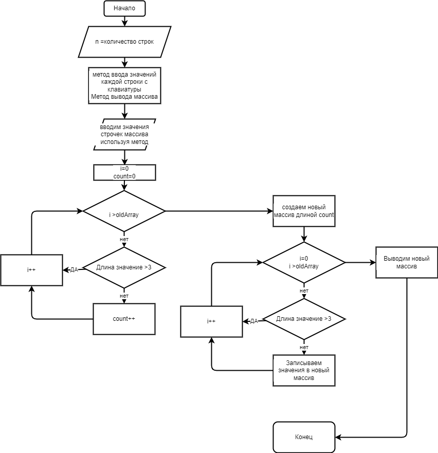

# **Задача :** #
Написать программу, которая из имеющегося массива строк формирует массив из строк, длина которых меньше либо равна 3  символа. Первоначальный массив можно ввести с клавиатуры, либо задать на старте выполнения алгоритма. При решении не рекомендуется пользоваться коллекциями, лучше обойтись исключительно массивами
   
   ## Описание решения

1. Создаем метод ввода натуральных чисел для определения количества будущих строк массива. Для этого попадаем в цикл и любое введнное значение проверяется является ли оно натуралным числом. Если число натуральное, то выходим из цикла и метод возвращает введенное значение переменной иначе придется повторить ввод

2. Создаем метод ввода данных строк массива от клавиатуры. Каждое значение вводится нажатием на клавишу [ENTER]

3. Создаем метод вывода массива на экран.

4. Создаем метод для создания нового массива, состоящего из предыдущего, только с условием, что значение строки состоит больше 3-х символов. Метод возвращает значение массива.

5. Выводим новый массив используя метод описанный в пункте 2.

## Примерная Блок-схема

   